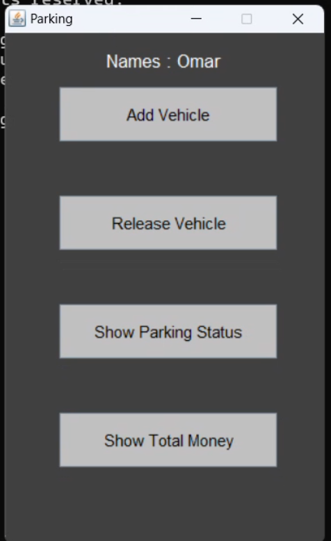
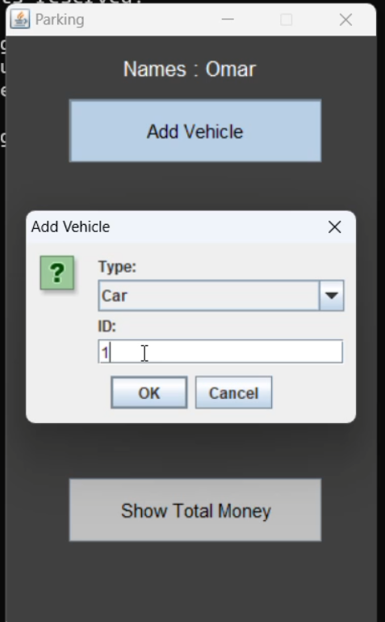
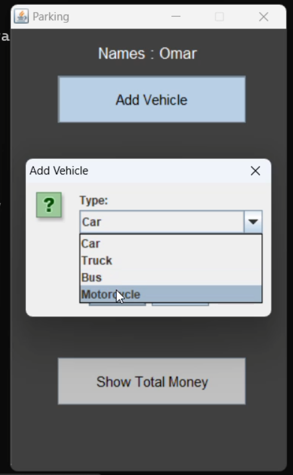
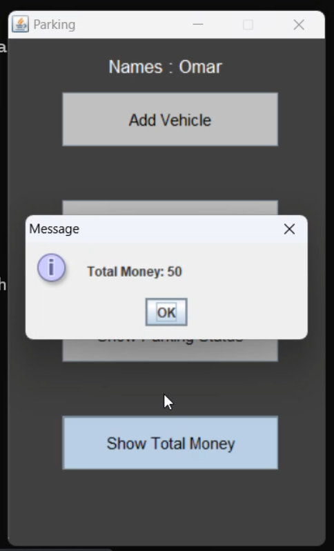
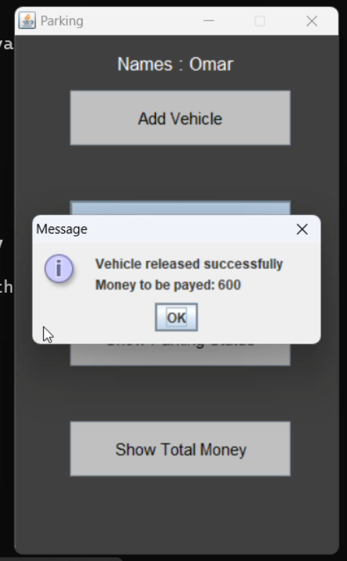
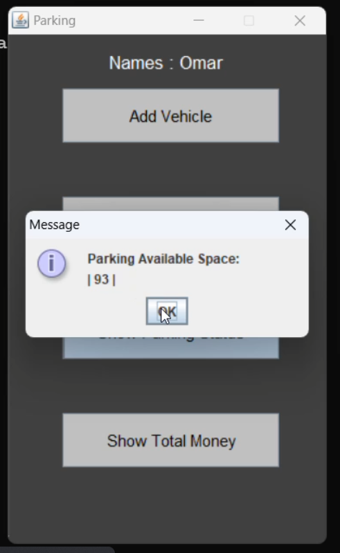

# Vehicle Parking Management System 🚗

A Java-based parking management system that efficiently manages a 100-meter parking space with automated space allocation and fee calculation.

## Project Requirements 📋

### Core Features
- Dynamic space allocation based on vehicle length
- Automatic merging of adjacent free spaces
- Real-time parking status monitoring
- Fee calculation based on duration

### Vehicle Specifications

| Vehicle Type | Length (m) | Rate (per hour) |
|-------------|------------|-----------------|
| 🚛 Truck    | 7         | $15            |
| 🚌 Bus      | 10        | $15            |
| 🚗 Car      | 5         | $10            |
| 🏍️ Motorcycle| 2         | $5             |

## Tech Stack 🛠️
- Java
- Swing (GUI)
- OOP Principles

## Screenshots 📸

<table>
  <tr>
    <td></td>
    <td></td>
  </tr>
  <tr>
    <td><em>Main Interface</em></td>
    <td><em>Add Vehicle</em></td>
  </tr>
  <tr>
    <td></td>
    <td></td>
  </tr>
  <tr>
    <td><em>Choose Vehicle Type</em></td>
    <td><em>Release Vehicle</em></td>
  </tr>
  <tr>
    <td></td>
    <td></td>
  </tr>
  <tr>
    <td><em>Parking Overview</em></td>
    <td><em>Available Spaces</em></td>
  </tr>
</table>

## Demo Video 🎬
Watch the full demonstration of the Vehicle Parking Management System in action:

 
  

