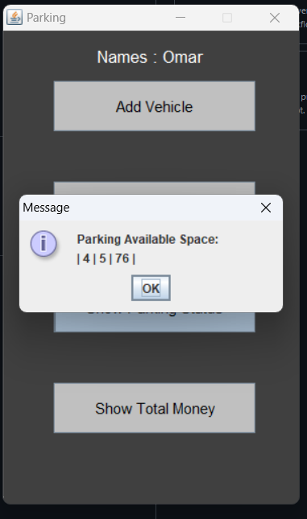

# Vehicle Parking Management System

A Java-based parking management system with a graphical user interface for efficient vehicle parking management.

## 🎥 Demo Video

https://github.com/user-attachments/assets/ef83ce44-a124-4027-ad5c-3102ca54f474

## 📸 Screenshots

Here's a visual walkthrough of the application:

### 1. Main Interface

### 2. Add Vehicle

### 3. Choose Vehicle Type

### 4. Release Vehicle

### 5. Release Vehicle

### 6. Available Spaces

## 🚀 Features

- Intuitive graphical user interface
- Real-time parking space management
- Multiple vehicle type support
- Efficient entry and exit system
- Visual representation of parking spaces

## 🛠️ Technologies Used

- Java
- Swing (GUI Framework)
- Object-Oriented Programming

## 👨‍💻 Author

- [@Omar7001-B](https://github.com/Omar7001-B)

## 📝 License

This project is licensed under the MIT License - see the LICENSE file for details.
